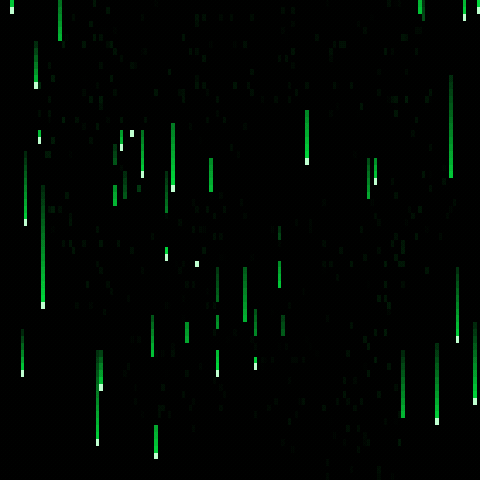

# apr-rain

Matrix rain that condenses into **Alejandro Revilla's** headshot — founder of
[jPOS](https://jpos.org) and [Transactility](https://transactility.com).



Green katakana rain falls down your terminal; over a few seconds the subject
of the headshot snaps in as bright, slowly-mutating glyphs, carving the face
out of the rain. After a hold period the face dissolves back into the rain and
the cycle repeats.

```
Usage: apr-rain [OPTIONS]

Options:
  -i, --image <IMAGE>          headshot image [default: assets/headshot.jpg]
      --fps <FPS>               frames per second [default: 30]
  -d, --duration <SECONDS>     total run time, 0 = until keypress [default: 0]
      --reveal-secs <SECS>     time for the face to condense [default: 8]
      --hold-secs <SECS>       time to hold the revealed face [default: 10]
      --loops <N>              reveal/hold cycles, 0 = forever [default: 0]
      --color <COLOR>          green | amber | cyan | magenta | white [default: green]
      --invert                force luminance inversion
      --threshold <BIAS>     Otsu threshold bias, -1..1 [default: 0]
      --charset <SET>         matrix | jpos | ascii | binary [default: matrix]
      --screenshot <PNG>      headless: write final frame to PNG
      --ticks <N>             ticks to simulate before screenshot
      --cell-px <PX>          screenshot cell block size [default: 12]
```

Press any key to quit.

## Build & run

```sh
cargo build --release
./target/release/apr-rain
```

The headshot is embedded in the binary at build time, so the standalone
binary works without the `assets/` directory.

## How it works

1. **Face mask** — the image is luminance-sampled onto the terminal grid
   (aspect-corrected for ~1:2 terminal cells, letterboxed to the grid's
   screen aspect). A subject mask is derived either from a sidecar
   `<image-stem>.mask.png` file (white = subject) if present, or
   automatically via polarity detection (is the image center darker than the
   whole image?) + Otsu thresholding + a 3×3 majority filter.
2. **Shadow recovery** — original luminance is percentile-stretched *within*
   the subject region only, so facial detail (glasses, smile, hair)
   survives dark exposures.
3. **Matrix rain** — one drop per column with random speed, trail length and
   respawn delay; trails fade from bright head to dark tail.
4. **Reveal** — each face cell snaps in at a random time within the reveal
   window (brighter cells earlier), rendering as bright base-colored glyphs
   with occasional mutation (2%/frame) and white sparkle (0.4%/frame).
   Face cells take precedence over rain; the background stays pure rain.
5. **Dissolve** — after the hold period the face fades back out over ~40% of
   the reveal time and the cycle restarts with fresh randomization.

Headless verification (used during development):

```sh
./target/release/apr-rain --screenshot frame.png --ticks 390   # single frame
./target/release/apr-rain --anim cycle.gif --cell-px 6        # animated GIF
```

## Charsets

- `matrix` — katakana + digits + symbols (default)
- `jpos` — hex digits `0-9 A-F` (ISO 8583 vibes)
- `ascii` — printable ASCII
- `binary` — zeros and ones

## Assets

- `assets/headshot.jpg` — the headshot (embedded at build time)

To use your own image: `apr-rain -i photo.png`. For difficult photos
(subject in shadow, busy background) you can supply a segmentation mask as
`photo.mask.png` next to the image (white pixels = subject) — e.g. produced
with OpenCV GrabCut.
